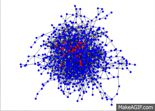

# NetworkCascade
This project will look at cascading a property through a social network graph.  It will specifically look at  ranking nodes based on certain centrality properties in order to create the maximum cascading effect with the minimum amount of seeding.  Below is the model of the the cascade in action.

Model of a Network Cascade
  
 
 [The GraphStream library is used to visualize the network cascade.](http://graphstream-project.org/) 
 
 The nodes of the graph represent people in a social network, the edges represent friendships between people in the social network, and the color of the nodes represents the property that is cascading throught the network.

Data:
UCSD facebook data was used.  It is clear that diffusion can only occur in a strongly connected graph given that all the edges in the facebook data are all reciprocal (i.e. if v is friends with u, then u is friends with v).  A quick analysis of the UCSD data:

|Data				|# of Vertices		   | # of Edges		|# of SCC’s|
|-------------------------------|:------------------------:|:------------------:|-----------:|
|Facebook_1000.txt	        |   783			   |    3784		|	1    |
|Facebook_2000.txt		|    1780	           |	15650		|	13*   |
|Facebook_UCSD.txt		 |14948			   |   886442		 |	 7*   |

*These 13 SCC’s are composed of one large graph with 1755 nodes and 12 very small graphs with 3 or less nodes.
**These 7 SCC’s are composed of one large graph from 14936 nodes and 6 very small graphs, each with 2 nodes.

I looked at the large SCC of each set of data.  

PropertyAB is required for the cascade of the graph.  This can either be A or B, and it will be set to the default value of B in the constructor. 
Centrality properties for degrees, 2 hop degrees and closeness will also be stored and used for ranking node importance in order to see the graph for the cascade.
Algorithms:

**Cascade Algorithm:** 
p = the fraction of friends that use A = number of neighbors with Property A/ D 
(1-p) =  the fraction of friends that use B 
D = Total number of friends 
**Reward given for neighbor vertices u and v:** 

|Vertex and its Property:		|Vertex u: A		|Vertex u: B|
|---------------------------------------|:---------------------:|:---------:|
|Vertex v: A				|               a	|       0   |
|Vertex v: B		        	 |              0	|	b   |

Reward for switching to A = pDa  		Reward for switching to B = (1-p)Db 
To switch from B to A:  p>b/(a+b) 

PseudoCode
1.	Run x number of generations  		
2.	For each generation :  
o	Calculate p for nodes whose neighbors have changed in previous generation  
o	Make changes to nodes based on p values 
o	Repeat for next generation until x number of generations OR No more changes – equilibrium reached 

Algorithm Analysis:
The cascade was implemented using the algorithm steps above.  In order not to go through the entire list of vertices for each generation, I would keep a list (in a HashSet  for O(1) lookup) of nodes that changed in each generation.  This means, I just have to check p for the nodes that have neighbors that have changed in the previous generation.  For V vertices, E edges, I have n nodes that changed in a generation, that is less than V and can be considered a constant.  Calculate p for all neighbors of the n nodes.  Maximum number of neighbors for a node is V-1 or V.  Looking at a worst case scenario run time of O(nV) where n is a constant, meaning we are left with a linear O(V).  Repeat this for X generations.  X is much smaller than V and can be considered constant.   This means the running time remain linear at O(V).  

**Ranking Closeness Algorithm and its Analysis** 
	Closeness = Average Distance (number of hops) from a node to all other nodes 
PseudoCode: 
1.	For all vertices in the graph: 			O(V) 
	+ a.	Calculate Closeness:			O(|V+E|) 
		+ i.	BFS through entire graph summing all distances from starting node to all other nodes (similar to Answer from part 1 but instead of saving maximum value, summing all values). 
		+ ii.	Divide Total by the number of paths to get average. 
	+ b.	Store Closeness Value 			O(1) 
	+ c.	Rank top percent of closeness Values (Minimum  Values top ranked)  
		+ i.	If Value is < the Maximum Value of Ranked List: 
1.	Insert node into ranking list in order of Descending Closeness Values using a binary search to find the proper location to insert.  The length of this list is only a percent of the total number of Vertices – percent should be much less the V, some number n.  O(log n) with n being a constant: O(1). 

Total Run Time: O(V(V+E)) – quadratic

